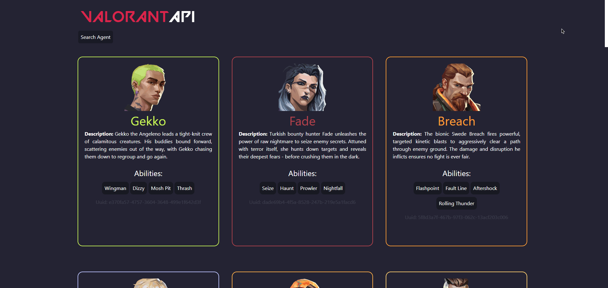
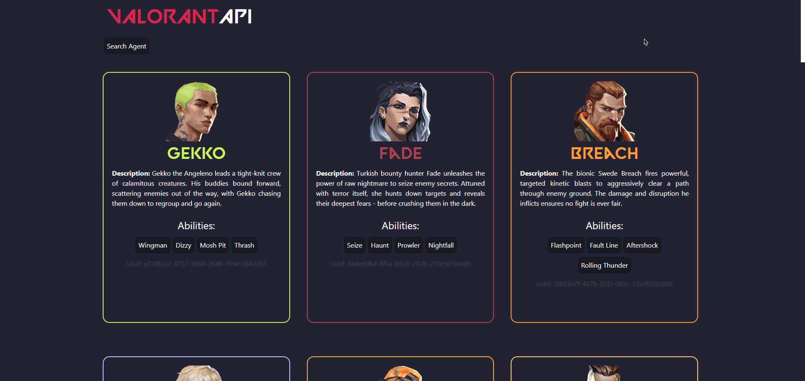
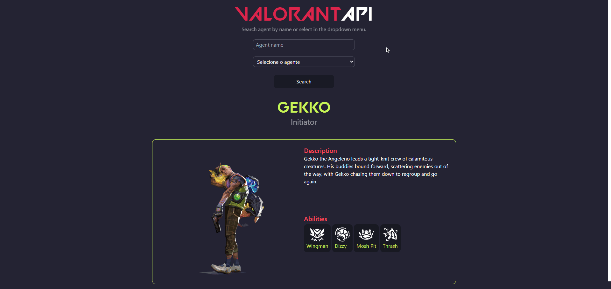
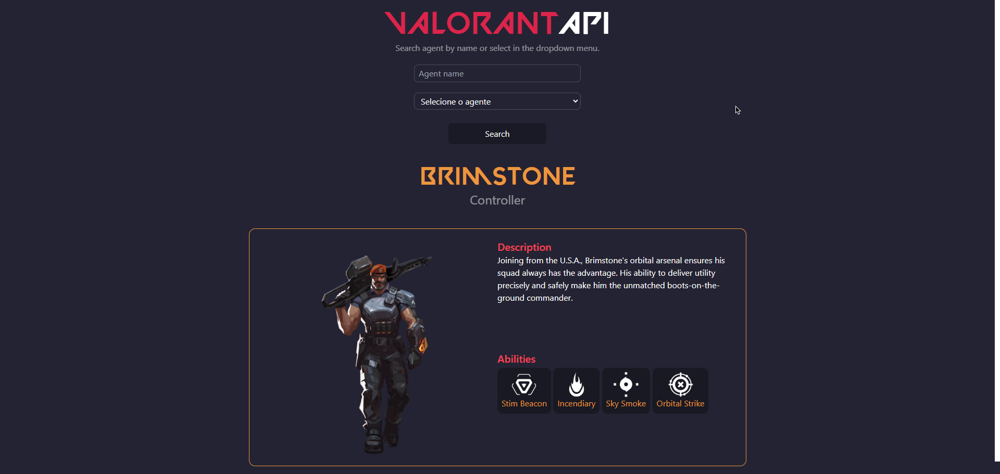

<div>

<h1>VALORANT API WEB APP</h1>
A web app made with js, express, axios, ejs, html, css and jquery to consume and renderize informations from the game Valorant.
</div>
<br>


## Development Stack

### Languages
- JavaScript

### Style Sheet Language
- CSS

### Markup Languages
- HTML

### Libraries/Frameworks
- EJS
- Axios
- Express
- Dotenv
- jQuery
- Tailwind

# How to run

Requirements
To run this application, ensure you have the following installed:

**Node.js**: You can download and install Node.js from [here](https://nodejs.org/en).

Clone the repository:
```bash
git clone <repository_url>
```

Navigate to the project directory:
```bash
cd <project_directory>
```
Install dependencies:
```bash
npm i
```

⚠️*(To install the dependecies you will need to open the terminal in the same directory as the index.js or package.json)*

# Set up environment variables:

Inside the root directory of this project there is a .env file.
You can change the PORT by editing this variable:
```makefile
PORT=<port_number>
```
Replace <port_number> with the desired port number for the server.

# Start the server

You can start your server by oppening a new terminal on the root directory of this project and typing:

```bash
node index.js
```

or typing:

```bash
npm start
```

# Access the application
Open a web browser and navigate to http://localhost:<port_number> where <port_number> is the port specified in the .env file.

*for example if you set PORT to 8000 in the `.env` file, then it would be http://localhost:8000/*

# Usage

On the main page's root URL, you can view and explore a comprehensive list of all Valorant agents:


- Additionally, you can interact with any agent card by clicking on it:



- You have the option to search for agents by their name:





or simply by selecting the agent's name from the dropdown menu:


